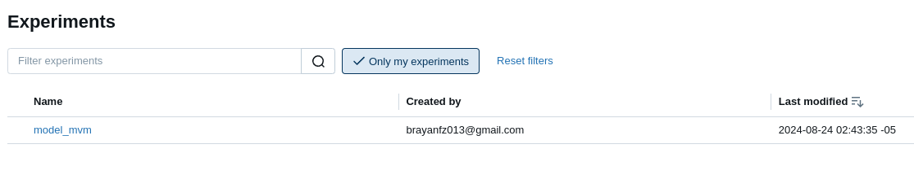
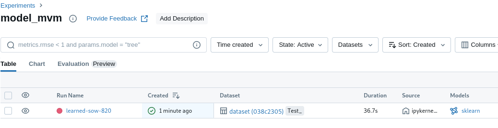
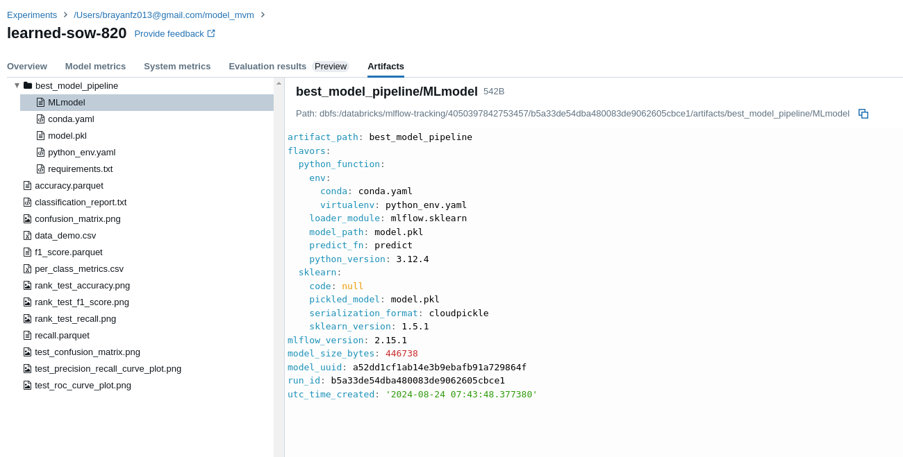
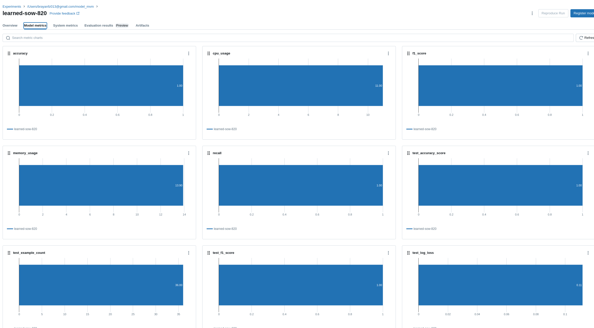

# PRUEBA TÉCNICA Databricks MLOps + IA

Condiciones generales de la prueba:

    - El aspirante tendrá máximo 3 días calendario para realizar la prueba y entregarla.

    - Podrá elegir qué puntos resolver según su experiencia, habilidad y tiempo disponible. Tenga en cuenta lo anterior para acercar sus resultados al nivel del perfil que buscamos: senior, medium o junior.

    - Se valorará un entregable bien documentado.

    - Los entregables de los desafíos #1 y #2 deben ser publicados en su GitHub personal y compartido el enlace del repo de forma pública (NO privada),incluyendo código fuente, artefactos y documentación. 


## __[DESAFIO #1] Machine Learning & MLOps__

A partir del conjunto de datos sugerido, se solicita implementar un modelo que pueda clasificar los vinos en sus variedades de uva:
    0 (variedad A)
    1 (variedad B)
    2 (variedad C)

Para trabajar este caso de uso, se proporciona el siguiente conjunto de datos:

Datos (CSV): https://archive.ics.uci.edu/ml/machine-learning-databases/wine/wine.data

Referencia de etiquetas de las variables que componen el conjunto de datos: https://archive.ics.uci.edu/ml/machine-learning-databases/wine/wine.names

Desarrollar el modelo de clasificación teniendo en cuenta:

    - Requiere crear una cuenta gratuita en la plataforma Databricks Community Edition (CE). Ver enlace de referencia: https://t.ly/IjRUp

    - Databricks Community Edition (CE) será la plataforma donde se registrarán los diferentes resultados de los experimentos realizados al modelo, así como la trazabilidad de los entrenamientos y las métricas de evaluación.

    - Será libre de escoger desarrollar y ejecutar el modelo en ambiente local mediante un script de Python, o directamente en Databricks Community Edition (CE) mediante un Notebook de Python/Spark. Ver enlace de referencia: https://t.ly/zIgqP

    - En cualquiera de los dos casos (ambiente local o Databricks Community), el resultado de los diferentes experimentos deberá quedar registrado en Databricks Community Edition (CE). Para lograr este objetivo, deberá hacer uso de la librería MLflow.

    - Realizar el preprocesamiento de los datos, considerando: la identificación y tratamiento de datos faltantes, valores atípicos y el grado de balanceo entre los valores de la variable clase, entre otras consideraciones.

    - Entrenar un modelo de clasificación para analizar las características químicas y visuales de las muestras de vino y clasificarlas según su cultivo (variedad de uva). Es importante realizar experimentos con distintos algoritmos de clasificación y elegir el óptimo explicando claramente los criterios de elección del mejor modelo. Los resultados de los entrenamientos deberán quedar registrados en Databricks Community Edition (CE). Las capturas de pantalla con las evidencias deberán ser incluidas en la documentación del repo.

    - Evaluar el rendimiento predictivo del modelo. Graficar resultados de las distintas métricas que expliquen su efectividad. Los resultados de las métricas de  valuación de los diferentes experimentos deberán quedar registrados en Databricks Community Edition (CE). Las capturas de pantalla con las evidencias deberán ser incluidas en la documentación del repo.

    - Redactar las conclusiones explicando los resultados.

    - La documentación de la solución será un aspecto que consideraremos. Puede realizar un “readme” markdown en GitHub, publicar un PDF, desarrollar un notebook, o cualquier otra alternativa que considere a bien.

    - Siéntase libre de registrar los errores que cometa en el proceso de implementación; entendemos y aceptamos la incertidumbre y vemos oportunidades cuando los errores son comprendidos y superados. Piense en la deuda técnica y hazla explícita en la documentación.

    - Ejecutar el modelo definitivo, ponerlo a prueba para predecir la variedad de uva dado las siguientes dos (2) nuevas muestras de vino y mostrar el resultado de la predicción:

    ```python
    [13.72,1.43,2.5,16.7,108,3.4,3.67,0.19,2.04,6.8,0.89,2.87,1285]
    [12.37,0.94,1.36,10.6,88,1.98,0.57,0.28,0.42,1.95,1.05,1.82,520]
    ```
    
Entregable: Publicar todos los artefactos desarrollados en un repo de GitHub. Incluir la documentación de lo realizado. Se valorará el paso-a-paso y las capturas
de pantalla con las evidencias de las pruebas realizadas. Si le resulta más sencillo sustituir la documentación por un video explicativo, está muy bien, entonces no
olvide publicar enlace al video y asegurarse que quede accesible.

# Solucion  Desafio #1

Para Resolver este realizo un analisis exploratorio de los datos el cual se puede ver en el notebook denominado [01_EDA.ipynb](src/notebooks/01_EDA.ipynb) donde se encuentra el analisis con sus respectivas explicaciones

Despues de esto se procede a realizar el proceso de entranamiento en base a los resultado del primer notebook, el proceso de entrenamiento tambien se encuntra registrado y explicado en el notebook [02_model.ipynb](src/notebooks/02_model.ipynb)
donde se encuenrta como ejecuta y se registra en `Databricks` igualmente se anexan unas capturas de le ejecucion para determinar la constancia del entrenamiento

Creacion de instancia 


Ejecucion de entrenamiento


Seleccion y carga del mejor modelo


Graficas de metricas registras en el entrenamiento


Esta solucion puede ser ejecutada siempre y cuando se cumpla con los paquetes que se encutran en el archivo [pyproject](pyproject.toml) lo archivos generados se guardan en entorno local 

En la carpeta SRC del repositorio se encuentra varios archivos generado:

- [mejor_modelo](src/mejor_modelo.pkl)  : Contiene el modelo entrenado en formato plk
- [confusion_matrix](src/confusion_matrix.png) : Contiene la grafica de la matriz de confucion de la muestra de la fase de prueba del modelo 
- [rank_test_accuracy](src/rank_test_accuracy.png) : Contiene la grafica comparativa para del rendimiento de los modelos para la metrica de  accuracy
- [rank_test_f1_score](src/rank_test_f1_score.png) : Contiene la grafica comparativa para del rendimiento de los modelos para la metrica de  f1_score
- [rank_test_recall](src/rank_test_recall.png) : Contiene la grafica comparativa para del rendimiento de los modelos para la metrica de recall
- [accuracy](src/accuracy.parquet) : Contiene el resultado de evalucion de los 10 primeros modelos en formato de texto parquet para la metrica accuracy
- [recall](src/recall.parquet) : Contiene el resultado de evalucion de los 10 primeros modelos en formato de texto parquet para la metrica recall
- [f1_score](src/f1_score.parquet) : Contiene el resultado de evalucion de los 10 primeros modelos en formato de texto parquet para la metrica  f1_score
- [data_demo](src/data_demo.csv) : Contiene la evaluacion de las clases solicidatas en formato parquet donde se muestra las predicciones del mejor modelo

En este ejercicio no encontre mayores dificultades en el proceso dado el volumen de datos y su distribucion 
es un ejercicio bastante entretenido el realizar la explicacion y registro de metricas de entrenamiento para modelo de clasificacionl.


## __[DESAFIO #2] Técnicas para el procesamiento del lenguaje (NLP + LLMs)__
Se desea automatizar y elevar el nivel de precisión del proceso de revisión de perfiles de hojas de vida (CV). Para cumplir con este objetico se debe implementar un modelo IA basado en técnicas NLP, LLMs, o una combinación de algunas de estas.
El proceso de revisión busca obtener la siguiente información (especificaciones técnicas del perfil), de cada hoja de vida:

    - Nombre completo del candidato
    - Email o teléfono de contacto
    - Número total de años de experiencia profesional
    - ¿Tiene formación en inteligencia artificial? (S/N)

### PRUEBA TÉCNICA Databricks MLOps + IA

El modelo IA deberá retornar un conjunto de datos en formato JSON, con el resultado de la validación, el cual debe contener los valores obtenidos por cada especificación técnica, incluyendo un valor de score que indicará el nivel de precisión o el porcentaje de ajuste del valor obtenido por cada especificación técnica. Es libre de definir el formato del JSON resultante.

En el ZIP adjunto encontrará una carpeta “CVs” con una muestra de hojas de vida.

En los casos, donde el modelo IA no pueda obtener un valor, deberá registrar un valor nulo con un score de cero (0).
Sugerencias:

    - Trabaje en un modelo IA prototipo, que sirva como prueba de concepto. Por el tiempo que exige la prueba, no esperamos que nos entregue un modelo perfecto. Nos interesa el enfoque de la solución y una prueba de concepto verificable.

    - El lenguaje de programación a usar debe ser Python. Siéntase libre de incorporar las librerías que considere a bien.

    - Considere desarrollar el ejercicio usando un Notebook de Google Colab. Publique el Notebook en el repo de GitHub. Si incluye un botón de enlace o un link al Notebook en Google Colab, por favor compartirlo a la cuenta jorgegr79@gmail.com

    - La documentación de la solución será un aspecto que consideraremos. Puede realizar un “readme” markdown en GitHub, publicar un PDF, desarrollar un notebook, o cualquier otra alternativa que considere a bien.

    - Siéntase libre de registrar los errores que cometa en el proceso de implementación; entendemos y aceptamos la incertidumbre y vemos oportunidades

cuando los errores son comprendidos y superados. Piense en la deuda técnica y hazla explícita en la documentación.
Entregable: Publicar todos los artefactos desarrollados en un repo de GitHub. Incluir la documentación de lo realizado. Se valorará el paso-a-paso y las capturas
de pantalla con las evidencias de las pruebas realizadas. Si le resulta más sencillo sustituir la documentación por un video explicativo, está muy bien, entonces no olvide publicar enlace al video y asegurarse que quede accesible.


# Solucion  Desafio #2

La solucion de este ejercicio fue realizada en el notebook denominado [03_cv_parser](src/notebooks/03_cv_parser.ipynb) el cual se encuentra en este [enlace](https://drive.google.com/file/d/1-Y3NcX07is7RswpOHYpV8REztSAHlbgj/view?usp=drive_link) enlace que lleva directamente google drive 

En este ejercicio, encontre con la experiencia de manipulacion de CV, lo cual fue una experiencia nueva para mi, dada esta situacion de Extraer especificamente unos datos puntuales,He usado HuggingFace anteriormente, pero otras aplicaciones de LLM, en esta ocacion  que quedo en deuda en temas de *repetitividad* de la ejecucion del modelo en base a la cantidad de tiempo que le dedique y la manipulacion del ciertos resultados, pero me sientro tranquilo porque al final encontre nuevamos modelos que puedo seguir ejecutando en el futuro para cosas bastante puntuales. 


En general  del proceso de la prueba gracias por la oportunidad de revisitar concepto  y metodos y aprender unas cuantas cosas nuevas que siempre biene bien. independiente del resultado gracias.